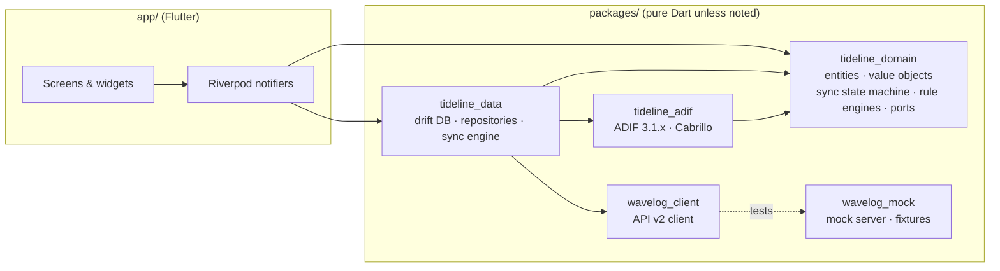

# Architecture overview

Tideline is an offline-first Flutter app. The local encrypted database is the single source of truth for the UI.
Wavelog synchronisation is a separate, resumable and idempotent background process that never blocks logging.

## Workspace layout

## Layers and rules

| Layer | Lives in | May depend on | Must not depend on |
|---|---|---|---|
| Presentation | `app/lib/src/features/*`, `app/lib/src/design/` | domain, data (through providers) | http, raw SQL |
| Domain | `tideline_domain`, `tideline_adif` | Dart core only | Flutter, drift, http |
| Data | `tideline_data`, `wavelog_client` | domain, drift, http | Flutter widgets |

- **Repositories** are declared as interfaces (ports) in the domain and implemented in `tideline_data`.
- **UI updates** come only from DB streams (drift `watch` queries) exposed through Riverpod providers. A completed
  sync step therefore updates the UI the same way a local edit does.
- **Logging a QSO** is one local transaction. It writes the QSO, its `qso_sync` row (`queued` or `local`) and, if needed,
  a serial allocation. It returns before anything touches the network.

## Sync engine

- One worker per app instance, processing each account's queue in order.
- **Triggers:** app foreground, connectivity regained (followed by a real reachability probe, because
  connectivity_plus only reports interface state), and manual "Sync now".
  - On iOS there is no background-sync promise.
  - Android periodic background sync may be offered later as an opt-in.
- **Before each run:** capability probe (`status`, `token`, `catalog`) and a station-list refresh.
- **Per QSO:** follows the [sync state machine](sync-state-machine.md). Each transition writes to `sync_journal`.
- **Backoff:** exponential with jitter, and `Retry-After` is honoured exactly.
- **Uncertain outcomes** (timeouts, 5xx, an app kill mid-request) resolve through a reconcile query, never a blind retry.

## Networking and trust

- `wavelog_client` takes an injected HTTP client. The app builds it with a `SecurityContext` that trusts:
  - the platform roots; or
  - exactly one pinned certificate fingerprint per account (trust-on-first-use, explicit and warned).
  See [ADR 0009](../adr/0009-tls-tofu-pinning.md).
- Plain HTTP is allowed only for private-LAN hosts, behind an opt-in.
- Tokens are added to requests by the client and redacted from every log line and error message.

## Adaptive UI

- **Window size classes** come from `MediaQuery.sizeOf` and drive layouts. Device type is never used.
  See [ADR 0010](../adr/0010-adaptive-size-classes.md).

  | Class | Width |
  |---|---|
  | compact | < 600 |
  | medium | < 840 |
  | expanded | < 1200 |
  | large | ≥ 1200 |

- **Commands and shortcuts:** a central command registry defines every command with its id, label, default shortcuts and
  scope. It drives `Shortcuts`/`Actions`, the in-app shortcut overlay and the manual's shortcut table.
  See [ADR 0011](../adr/0011-command-registry.md).

## Further reading

- [Data model](data-model.md)
- [Sync state machine](sync-state-machine.md)
- [Wavelog API notes](wavelog-api.md)
- [ADRs](../adr/)
