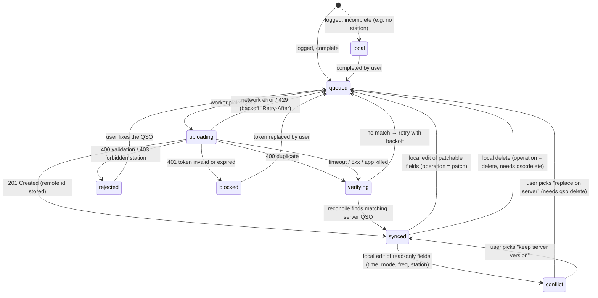

# Sync state machine

Each QSO has one `qso_sync` row per account. The domain implements this machine in `tideline_domain` as pure
functions: (state, event) → (state, effects). It is tested exhaustively without Flutter.

## States

| State | Meaning (user-facing wording lives in ARB files) |
|---|---|
| `local` | Saved on this device only; something is missing before it can be uploaded. |
| `queued` | Waiting for the next sync. |
| `uploading` | Being sent right now. |
| `verifying` | The outcome of the last attempt is unknown; Tideline is checking the server before retrying. |
| `synced` | On the server, with the server id known. |
| `conflict` | Changed locally in a way the server can't accept automatically; the user decides. |
| `rejected` | The server refused it; the reason is shown in plain language. |
| `blocked` | Waiting for the user to fix the account (for example an expired token). |

## Rules

1. **Crash safety:** on app start, every QSO found in `uploading` moves to `verifying`.
2. **Reconcile query:** `GET /qso?callsign=<call>&qso_since=<date>&qso_until=<date>&station_id=<id>`, matched on the
   server's duplicate tuple: call, `time_on` to the minute, band, mode, station. A match stores the remote id and moves
   the QSO to `synced`.
3. **No blind retries:** a QSO is only re-POSTed after a reconcile query has shown it is not on the server.
4. **Same-minute twins:** two local QSOs with an identical duplicate tuple (same call, minute, band, mode, station)
   cannot both exist on the server. The second one gets `conflict` with an explanation, never a silent drop.
5. **Dry-run preview:** before uploading more than a threshold number of QSOs (default 50), the user sees a preview.
   It combines a local duplicate check with the server's bulk `dryrun=true` parse result. The actual upload still uses
   single POSTs.
6. **Journal:** every transition appends to `sync_journal` with a redacted detail record.
7. **Tide gauge:** the level is the count of QSOs not in `synced` per account. It is always shown with a number and text
   ("12 QSOs waiting to sync"), never by colour or animation alone.

See [ADR 0008](../adr/0008-sync-idempotency-without-server-uuid.md) for the reasoning.

## Implementation notes

- The machine is implemented as pure code in `packages/tideline_domain/lib/src/sync/sync_machine.dart` (`SyncMachine.apply`).
  `test/sync_machine_test.dart` covers every rule above.
- An impossible transition throws `InvalidSyncTransition`, which means a bug in the caller.
- **Blocking:** an expired or revoked token blocks only `queued`, `uploading` and `verifying` QSOs. Drafts, conflicts,
  rejects and synced QSOs keep their state.
- **Unblocking:** after unblocking, a create that has no server id yet is verified once more before it is retried.
- **Deletes:** a QSO that never reached the server is deleted locally with no sync step. A synced QSO is deleted on the
  server only if the token has `qso:delete`; otherwise the journal records that the server copy remains. A delete
  during an upload waits for that upload's outcome.

## Contest sessions (Wavelog 3.2+)

Contest QSOs sync like any other QSO. In addition, a session can be mirrored as a Wavelog contest session
([ADR 0018](../adr/0018-contest-definitions-as-data.md)). This runs after the QSO pass of each sync run, only for
accounts with contest-session support and the `contest:write` scope. It never blocks the QSO pass.

`contest_sessions.remote_state`:

| State | Meaning |
|---|---|
| `local` | Not mirrored: the server is older than 3.2, the contest is not active there, the definition has no ADIF name, or the server session was deleted. Terminal; `remote_error_key` says why. |
| `pending` | To be created once at least one of its QSOs has a server id. |
| `verifying` | A `POST /contest` was in flight when the app stopped or the network failed. Reconcile before anything else. |
| `created` | `remote_session_id` is set. New QSOs are linked; a changed end time is patched. |

Steps per session, in order:
1. **Pending:** wait until a QSO of the session has a server id. Then set `verifying` (persisted *before* the request)
   and `POST /contest` with the contest ADIF name, the station's server id, start = session start, end = session end
   or the latest QSO time (Wavelog requires an end), `settings.exchangefields` derived from the definition, and
   `qso_ids` = the server ids so far. On success: `created`, `remote_end_synced`, and one `contest_links` row per linked
   QSO. An inactive or unknown contest (`400` on `contest`) → `local` with a reason. A missing scope → stays `pending`
   with a reason. Network or server trouble → stays `verifying`.
2. **Verifying:** `GET /contest?station_id=` and look for a session with the same contest and the same start time (to the
   minute). Found → adopt its id and continue as `created`. Not found → back to `pending` and create once, in the same
   run.
3. **Created:**
   - `PATCH /contest/{id}` with `link_qso_ids` for QSOs of the session that have a server id and no `contest_links`
     row. Linking is idempotent on the server. QSOs the server skips (already in another session) are recorded and
     journaled, so they are not retried forever.
   - When the end time moved past `remote_end_synced` (session ended, or later QSOs), patch `time_end`.
   - `404` → the session was deleted on the server: `local` with a reason. Tideline never recreates it on its own.

All steps write journal events, and every error key is localised. Session sync is idempotent: replaying any step after
a crash gives the same server state.

## Worked-before pull

After the contest step, each sync run pulls new server QSOs with `GET /qso?format=adif&since_id=<cursor>` and merges
them into `worked_before`. It reads at most 10 pages of 5,000 per run, so a large log fills in over several runs. Errors
here are logged and skipped and never fail the run. Because Wavelog has no `updated_since`, edits and deletes made on
the server only show up after "Rebuild worked-before index" in settings, which clears the index and the cursor.
