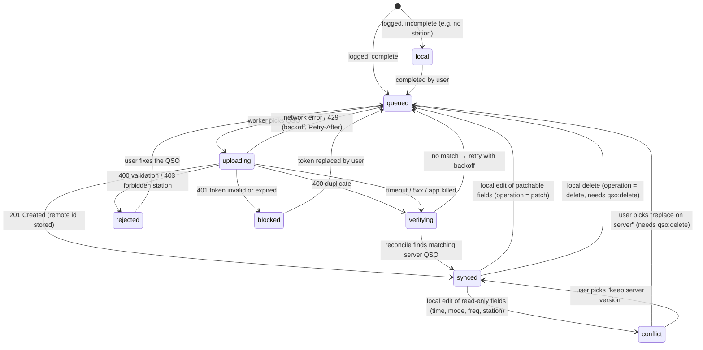

# Sync state machine

Each QSO has one `qso_sync` row per account. The domain implements this machine in `tideline_domain` as pure
functions: (state, event) → (state, effects). It is tested exhaustively without Flutter.

## States

| State | Meaning (user-facing wording lives in ARB files) |
|---|---|
| `local` | Saved on this device only; something is missing before it can be uploaded. |
| `queued` | Waiting for the next sync. |
| `uploading` | Being sent right now. |
| `verifying` | The outcome of the last attempt is unknown; Tideline is checking the server before retrying. |
| `synced` | On the server, with the server id known. |
| `conflict` | Changed locally in a way the server can't accept automatically; the user decides. |
| `rejected` | The server refused it; the reason is shown in plain language. |
| `blocked` | Waiting for the user to fix the account (for example an expired token). |

## Rules

1. **Crash safety:** on app start, every QSO found in `uploading` moves to `verifying`.
2. **Reconcile query:** `GET /qso?callsign=<call>&qso_since=<date>&qso_until=<date>&station_id=<id>`, matched on the
   server's duplicate tuple: call, `time_on` to the minute, band, mode, station. A match stores the remote id and moves
   the QSO to `synced`.
3. **No blind retries:** a QSO is only re-POSTed after a reconcile query has shown it is not on the server.
4. **Same-minute twins:** two local QSOs with an identical duplicate tuple (same call, minute, band, mode, station)
   cannot both exist on the server. The second one gets `conflict` with an explanation, never a silent drop.
5. **Dry-run preview:** before uploading more than a threshold number of QSOs (default 50), the user sees a preview.
   It combines a local duplicate check with the server's bulk `dryrun=true` parse result. The actual upload still uses
   single POSTs.
6. **Journal:** every transition appends to `sync_journal` with a redacted detail record.
7. **Tide gauge:** the level is the count of QSOs not in `synced` per account. It is always shown with a number and text
   ("12 QSOs waiting to sync"), never by colour or animation alone.

See [ADR 0008](../adr/0008-sync-idempotency-without-server-uuid.md) for the reasoning.
