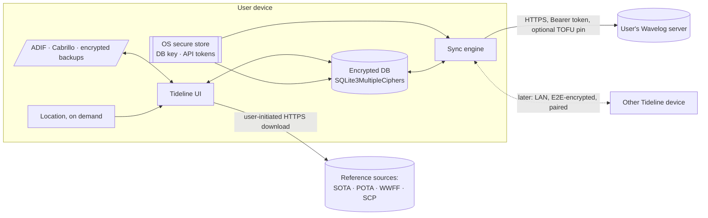

# Data flow

| # | Flow | Data | Protection |
|---|---|---|---|
| F1 | UI ↔ DB | QSOs, settings, packs | Encrypted at rest. The key is in the secure store. |
| F2 | Sync ↔ Wavelog | QSOs, station list, the user's log (worked-before) | TLS (platform roots or a pinned leaf), a scoped bearer token, strict JSON parsing |
| F3 | UI → reference sources | Download only. Nothing about the user is sent beyond the HTTP request itself. | TLS, size limits, a hash recorded, strict parsing |
| F4 | Files ↔ UI | ADIF/Cabrillo exports and imports; backups | Imports are parsed strictly (and fuzzed). Backups are encrypted with a user passphrase (Argon2id → AEAD). |
| F5 | Location → UI | Coordinates, converted to a Maidenhead grid on the device | Never stored raw. Never sent anywhere except as a grid in a QSO. |
| F6 | Device ↔ peer (later) | QSOs | Pairing by QR code; mutually authenticated, end-to-end encrypted |

Trust boundaries: between the device and every external system (F2, F3, F6), and between the app and imported files (F4).
